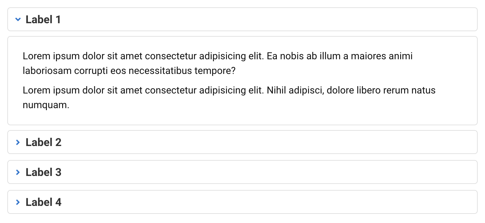
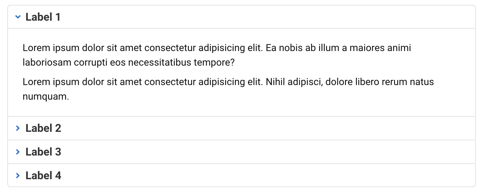
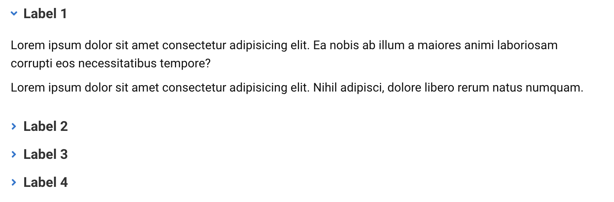

# Accordion

[](https://www.npmjs.org/package/elr-scss-accordion)
[](https://github.com/Beth3346/elr-scss-accordion/actions/workflows/node.js.yml)
[](https://opensource.org/licenses/MIT)
[](https://npmjs.com/package/elr-scss-accordion)
[](https://github.com/Beth3346/elr-scss-accordion)
[](https://app.netlify.com/sites/elr-accordion/deploys)

a scss mixin for accordions

[View Demo](https://elr-accordion.netlify.app/)

## Screenshots

### Default Accordion



### Accordion with no spacing



### Accordion with no border



## Installation

Download node at [nodejs.org](http://nodejs.org) and install it, if you haven't already.

```sh
npm install elr-scss-accordion --save
```

or

```sh
yarn add elr-scss-accordion
```

## Implementation

Its up to you to wire up the JavaScript to provide the accordion functionality. This way you can use any framework, library or even vanilla JavaScript.

### Arguments

- label-color
- border-radius
- color
- border-color
- icon-color

### Scss

```scss
@import "elr-scss-accordion/src/main";

.elr-accordion {
  @include elr-accordion(
    $config: (
      label-color: #333,
      border-radius: 3px,
      color: #333,
      border-color: #333,
      icon-color: #333,
    )
  );
}
```

### HTML

```html
<div class="accordion">
  <button class="accordion-label active" data-contentid="content-1">
    <h2 class="accordion-heading"><i class="accordion-icon fa fa-angle-down"></i><span>Label 1</span></button></h2>
  </button>
  <div id="content-1" class="accordion-content active">
    <div>
      <p>
        Lorem ipsum dolor sit amet consectetur adipisicing elit. Ea
        nobis ab illum a maiores animi laboriosam corrupti eos
        necessitatibus tempore?
      </p>
      <p>
        Lorem ipsum dolor sit amet consectetur adipisicing elit. Nihil
        adipisci, dolore libero rerum natus numquam.
      </p>
    </div>
  </div>
  <button data-contentid="content-2" class="accordion-label">
    <h2 class="accordion-heading"><i class="accordion-icon fa fa-angle-down"></i><span>Label 2</span></h2>
  </button>
  <div id="content-2" class="accordion-content">
    <div>
      <p>
        Lorem ipsum dolor sit, amet consectetur adipisicing elit.
        Pariatur eos animi illum voluptas obcaecati commodi nobis et,
        nam vero soluta explicabo recusandae unde provident perferendis.
        Neque optio odio numquam commodi.
      </p>
    </div>
  </div>
  <button class="accordion-label" data-contentid="content-3">
    <h2 class="accordion-heading"><i class="accordion-icon fa fa-angle-down"></i><span>Label 3</span></h2>
  </button>
  <div id="content-3" class="accordion-content">
    <div>
      <p>
        Lorem ipsum dolor sit amet consectetur adipisicing elit. Eveniet
        perferendis quo, minima accusantium, nihil, eius distinctio ea
        rem consequatur optio culpa quod harum? Dolores, perspiciatis.
      </p>
    </div>
  </div>
  <button class="accordion-label" data-contentid="content-4">
    <h2 class="accordion-heading"><i class="accordion-icon fa fa-angle-down"></i><span>Label 4</span></h2>
  </button>
  <div id="content-4" class="accordion-content">
    <div>
      <p>
        Lorem ipsum dolor sit amet consectetur adipisicing elit.
        Molestiae enim inventore minus sunt distinctio vitae obcaecati
        sequi, unde in placeat nam officiis explicabo cum quas
        dignissimos optio.
      </p>
    </div>
  </div>
</div>
```

## License

SEE LICENSE IN LICENSE.md
